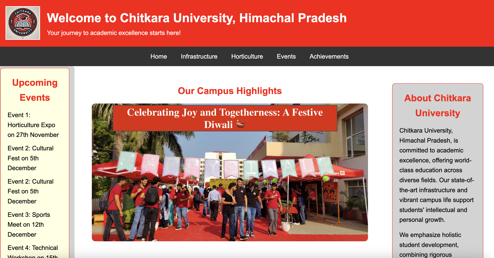

# Infra-Horti Event Expo

A modern and responsive web application showcasing the events and highlights of the Infra-Horti Expo. This project provides users with an interactive experience to explore event schedules, gallery sections, and other expo details.

## Live Demo
Check out the live project [here](https://anshgoyal05.github.io/infra-horti-event-expo/).

## Features
- Interactive and user-friendly interface
- Dynamic event schedule section
- Visual gallery showcasing event highlights

## Technologies Used
- HTML5
- CSS3
- JavaScript

## Installation
1. Clone the repository:
   ```bash
   git clone https://github.com/anshgoyal05/infra-horti-event-expo.git
   ```
2. Open `index.html` in your browser.

## Screenshots
  
_Homepage of Infra-Horti Event Expo_

## Future Enhancements
- Add animations for a more interactive experience
- Include a backend to manage dynamic content

## Contributions
Contributions are welcome! Please feel free to fork the repository and submit a pull request.

## Contact
Created by [Ansh Goyal](https://github.com/anshgoyal05) - feel free to reach out!
